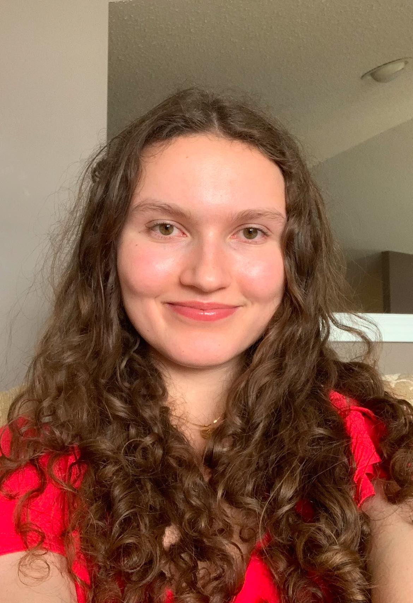

% Our Executives

## President
### Neil Roy Choudhury (He/Him)

### Program
Urban Planning

### Years debating
2 Years

### Fun facts
- Tried making pasta yesterday, couldn't do it. Ate macaroni & chicken nuggets instead.
- Likes debate

## VP Executive
### Eamon Tan (He/Him)

### Program
Finance

### Years debating
3 Years

### Fun facts
I've never read the Harry Potter books despite being a major book fan.
In contrast I've read the Percy Jackson series at least four times.

## VP Finance
### Naomi Gue (She/Her)

### Program
Double Major: Philosophy and History

### Years debating
2 Years

### Fun facts
- I love baking elaborate cakes
- My least favourite food are Pringles

## VP External
### Luke Markowski (He/Him)

### Program
Political Science

### Years debating
1 Year

### Fun facts
- I can ride a unicycle
- I have a beekeeping license
- I love arrested development

## VP Internal
### Rachel Kaup (She/They)

### Program
Business, Economics and Law

### Years debating
2 years

### Fun facts
My hair colour has changed six times in the past year

## VP Training (1)
### Angad Phagura (He/Him)

### Program
Major: History; Minor, Anthropology & Creative Writing

### Years debating
1 Year

### Fun facts
Ask me about the IVC in dialogue options when you talk to me to trigger a cut scene
(I will talk at you for 20 minutes about a 5000 year old culture)

## VP Training (2)
### Dhruv Kairon (He/Him)

### Program
Computer Science Honours in AI

### Years debating
2 Years

### Fun facts
- I have lived in eleven cities in my lifetime
- Instead of buying an iPad for notes, I got an Xbox instead

## VP Outreach
### Saim Humayun (He/Him)

### Program
Honours Neuroscience

### Years debating
5 Years

### Fun facts
I debate better than I swim (I can't swim)

## VP Marketing
### Elizabeth Chupka (She/Her)

### Program
4th year Secondary Education

### Years debating
1st year

### Fun fact
I am afraid of elevators

## Novice Member-at-Large
### Mia Benjatschek (She/Her)

### Program
1st year Computer Science

### Years debating
1st year

### Fun fact
When I was in elementary school,
I would tell my mom to stop talking to me
so I could concentrate on "breathing air"

## WGM Member-at-Large
### Tenisha Brar (She/Her)

### Program
1st year Neuroscience Honours

### Years debating
6.5 years!

### Fun fact
I have been followed by a giant tortoise and didn't even realize it

## Member-at-Large
### Alexandria Curran-Cook (She/Her)

### Program
1st year Political Science

### Years debating
1st year

### Fun fact
I've played violin for 12 years

